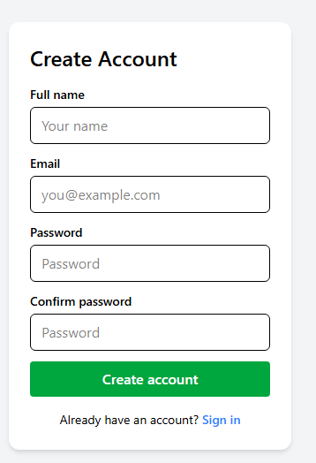
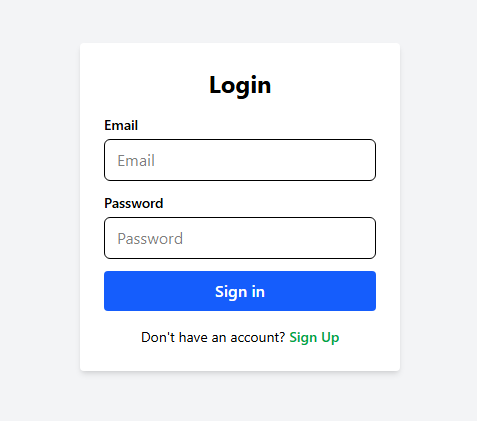
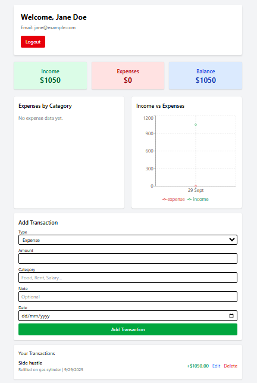

# 💰 Finance Tracker App

A **full-stack finance management application** that helps users track income and expenses, visualize trends, and manage their finances with ease.  

Built with **React (Vite + Tailwind CSS)** on the frontend and **Node.js + Express + MySQL2** on the backend.  
Includes JWT authentication, protected routes, and data visualization with Recharts.  

---

## 📸 Screenshots  
### Register Form
.

### Login Form
.

### Dashboard
. 

---

## 🚀 Features  

- 🔐 **Authentication**: Register/Login with JWT  
- 👤 **Role-based access** (Admin seeded by default)  
- 📝 **Transaction management**: Add, edit, delete income/expenses 
- 📊 **Data visualization**:  
  - Expenses by category  
  - Income vs expenses over time  
- 📈 **Summary cards**: Quick financial overview  
- 🔒 **Protected dashboard** with secure routes  
- 🌱 **Database setup**: MySQL schema + admin seeding script  

---

## 🗄️ Tech Stack  

**Frontend**  
- React (Vite)  
- Tailwind CSS  
- React Router  
- Recharts  

**Backend**  
- Node.js  
- Express  
- MySQL2  
- JWT  
- bcrypt  

---

## ⚙️ Setup Instructions  

### 1. Clone the repository  
git clone https://github.com/YOUR-USERNAME/finance-app.git
cd finance-app

---
### 2. Backend Setup
cd backend
npm install

Create a .env file in the backend folder:
PORT=5000
DB_HOST=localhost
DB_USER=root
DB_PASSWORD=yourpassword
DB_NAME=finance_app
JWT_SECRET=your_jwt_secret
ADMIN_NAME=admin name
ADMIN_EMAIL=admin email
ADMIN_PASSWORD=admin password

Seed admin:
npm run seed

Start backend server:
npm run dev

---

### 3. Frontend Setup

cd frontend
npm install
npm run dev

---
✅ Future Improvements

🌍 Multi-user budgeting (shared accounts)

💾 Export transactions as CSV/PDF

📱 Mobile-first UI enhancements

🔔 Email notifications for budget limits

---
🤝 Contributing

Contributions, issues, and feature requests are welcome!
Fork the repo and submit a PR.

---
📜 License

This project is licensed under the MIT License.

